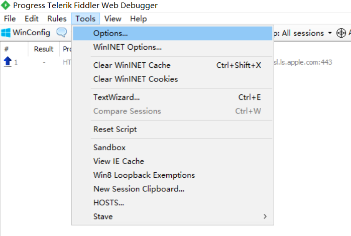
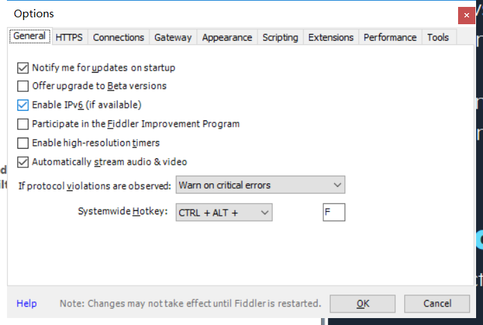
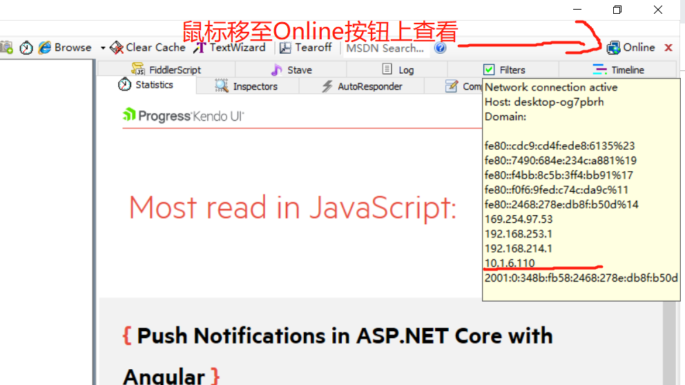
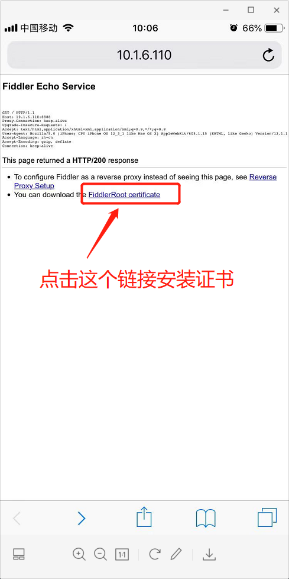

# Fiddler

## 简介
任何浏览器、系统或平台的免费Web调试代理。[官网](https://www.telerik.com/fiddler)

## 功能
#### 抓包工具
#### 反向代理
#### 请求断点调试（请求、响应）

## 使用场景
### 监控接口请求，验证数据正确性
### 通过修改请求参数，接口返回值修改数据进行调试
### 线上代码debug （将线上代码映射到本地），通过本地代码验证线上错误
### https代理服务器

## 起步
###下载安装
   [https://www.telerik.com/download/fiddler](https://www.telerik.com/download/fiddler)
### 基本配置
##### STEP1:

##### STEP2:

##### STEP3:

##### STEP4:

## 插件
### Stave
- 下载地址：[Stave](./assets/fiddler/Stave.zip)
- 安装方式：

## 实战应用
### 手机抓包
##### 1、查看本机IP

##### 2、通过手机浏览器访问  
  http://yourIP:8888 (ps: http://10.1.6.110:8888)

##### 3、安装证书  

##### 4、设置网络代理
> 设置》无线局域网》Aibao》点击》配置代理》手动》设置服务器IP、端口》存储
::: tip 提示
Android部分机型需要长按进入设置代理界面
:::

#### iOS
::: tip 提示
1、设置》通用》扫描文件与设备管理》DO_NOT_TRUST_FiddlerRoot》安装  
2、设置》通用》关于本机》证书信任设置》DO_NOT_TRUST_FiddlerRoot》开启
:::

#### Android
::: tip 提示
启用证书，机型差异较大请自行百度
:::
